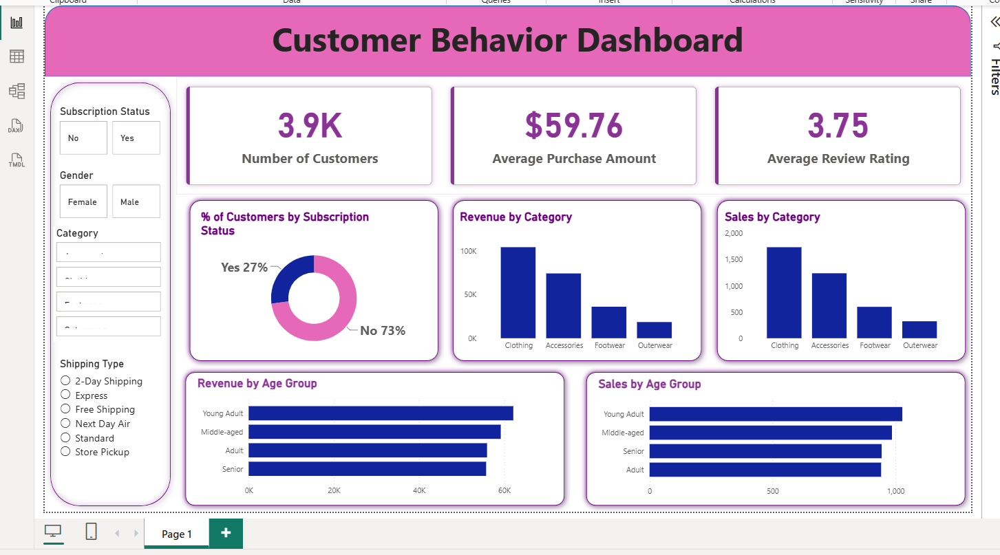

## Dashboard Preview

# Customer Shopping Behavior Analysis

## Overview
This project analyzes customer shopping behavior using transactional data from 3,900 purchases. The objective is to uncover customer spending patterns, product preferences, subscription behavior, and revenue-driving factors to support business decision-making.

## Tech Stack
- Python
- Pandas
- PostgreSQL
- SQL
- Power BI

## Dataset Information
- 3,900 customer transactions
- 18 features
- Customer demographics
- Purchase history
- Product categories
- Subscription details
- Review ratings

## Project Workflow
1. Data Cleaning & Preprocessing
2. Exploratory Data Analysis (EDA)
3. Feature Engineering
4. PostgreSQL Database Integration
5. SQL Business Analysis
6. Power BI Dashboard Development
7. Business Recommendations

## Key Business Questions Answered
- Revenue by Gender
- High-Spending Discount Users
- Top Rated Products
- Shipping Type Analysis
- Subscriber vs Non-Subscriber Analysis
- Customer Segmentation
- Revenue by Age Group
- Product Performance Analysis

## Dashboard Insights
- Total Customers: 3.9K
- Average Purchase Amount: $59.76
- Average Review Rating: 3.75
- Revenue by Category
- Sales by Age Group
- Subscription Analysis

## Business Recommendations
- Increase subscription adoption
- Improve customer loyalty programs
- Optimize discount strategies
- Focus marketing on high-value customer segments
- Promote top-rated products

## Repository Structure

├── Customer_Shopping_Behavior_Analysis.ipynb
├── customer_behavior_sql_queries.sql
├── customer_behavior_dashboard.pbix
├── customer_shopping_behavior.csv
├── Customer Shopping Behavior Analysis.pdf
├── Customer-Shopping-Behavior-Analysis.pptx
└── README.md

## Author
Pritam Mahamansingh
Data Analyst | Python | SQL | Power BI
